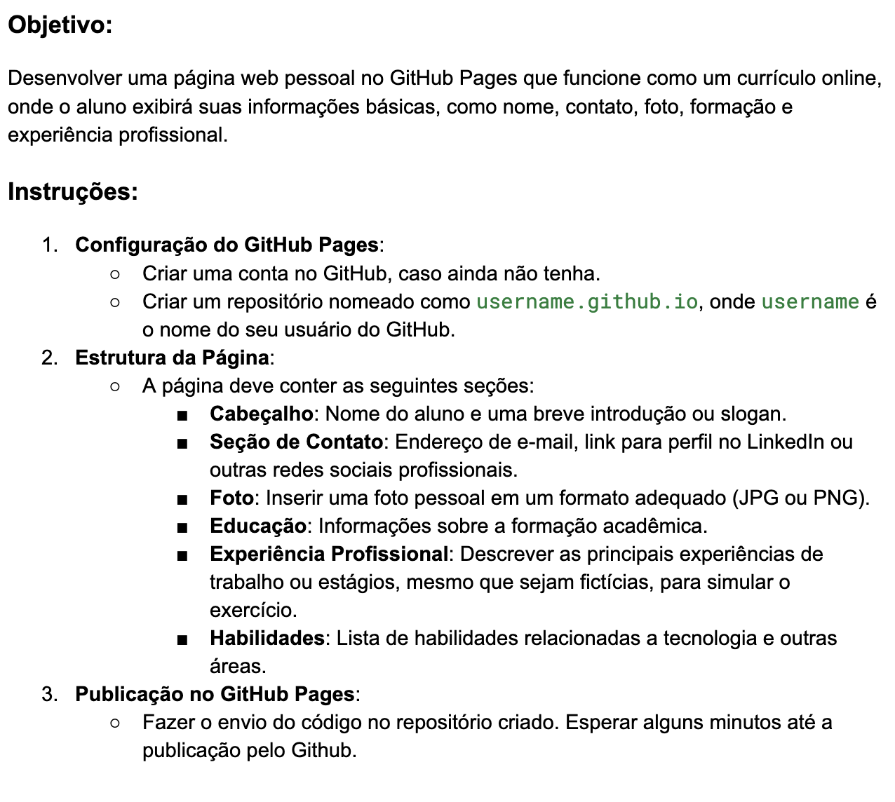

<h1 align="center">Currículo Online</h1>
<h2> Essa atividade foi produzida para cumprimento de requisição da matéria de
  Introdução às Tecnologias Web (EAD) do bacharelado de Sistemas de Informação,
  atualmente em curso, no Instituto Federal de Alagoas.
   
   
  
<a href="https://quokequack.github.io">Link do projeto</a>

  Requisição do professor:
</h2>

  

<h2> Funcionalidades obrigatórias </h2>
<ul>
  <li> Fatos pessoais (foto, nome, idade e etc.) ✅ </li>
  <li> Listagem de experiências acadêmicas e profissionais ✅</li>
  <li> Listagem de contatos ✅ </li>
  <li> Listagem de habilidades ✅</li>
  <li> Listagem de tecnologias com as quais tenho familiaridade ✅ </li>
</ul>
<h2> Tecnologias utilizadas </h2>

  

